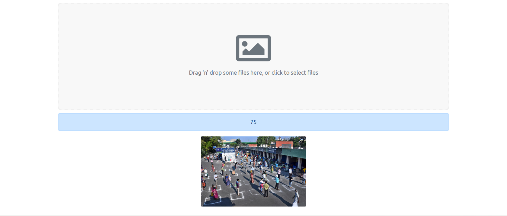

# crowd-counter

Simple Webpage for Counting the number of people in a crowd using Image Classification, Django,Django RestFramework(Backend) and React(Frontend)

Trained the Image Classification Model in Google Colab.The notebook is included in the files

Dataset URL: https://www.kaggle.com/fmena14/crowd-counting

Screenshot of the Frontend webpage:

